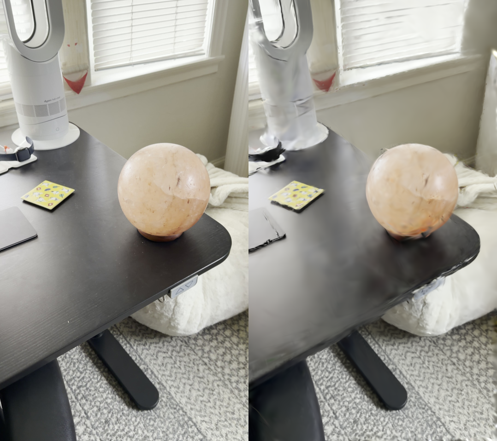

# mpsplat — get started in 5 steps

mpsplat is a Mac port of [gsplat](https://github.com/nerfstudio-project/gsplat).
You point your phone camera at something, walk around it for 30 seconds,
and at the end you get a **3D model you can fly through in your browser**.

## What you'll get



A free-viewpoint 3D capture of whatever you filmed — same idea as a 3D
photograph, except you can orbit, zoom, and fly through it. The image
above is a single frame from a real mpsplat training run. The
flythrough video below is what an automatic camera arc looks like at
the end of training:

https://github.com/zacsmms/mpsplat/raw/main/media/orb_flythrough.mp4

You'll go from this:

  📱 *a 30-second video of an object on your phone*

to this:

  🌐 *a `.ply` file you can drag into a browser viewer and orbit with the mouse*

## What you need

- A Mac with Apple Silicon (M1 / M2 / M3 / M4)
- A phone (any iPhone / Android made in the last 5 years)
- About 2 GB of disk space
- About 1 hour total: 5 min to capture, 30 min for COLMAP, 30 min for training

You do not need a GPU other than the one already in your Mac.

---

## 1 · Set up the tools (one time only, ~15 min)

Open Terminal and run:

```bash
# install command-line dependencies via Homebrew
brew install uv ffmpeg colmap

# clone the project
git clone https://github.com/zacsmms/mpsplat.git
cd mpsplat

# create the Python environment
uv venv --python 3.13
uv pip install --python .venv/bin/python -e gsplat
uv pip install --python .venv/bin/python -r gsplat/examples/requirements.txt
uv pip install --python .venv/bin/python "imageio[ffmpeg]"
```

Then add this helper to your shell so you don't have to type a long
command every time. Paste it into your terminal:

```bash
cat >> ~/.zshrc <<EOF
export MPSPLAT_ROOT="$(pwd)"
mpy() {
  PYTHONPATH="\$MPSPLAT_ROOT/gsplat:\$MPSPLAT_ROOT/gsplat/examples" \\
    "\$MPSPLAT_ROOT/.venv/bin/python" -P "\$@"
}
EOF
source ~/.zshrc
```

**One required tweak.** mpsplat reads COLMAP files using a small old
Python library called pycolmap that's incompatible with current Python.
Open this file in your favorite editor:

```bash
open .venv/lib/python3.13/site-packages/pycolmap/scene_manager.py
```

and apply 5 one-line patches:

- Line 22: change `np.uint64(-1)` to `np.uint64(2**64 - 1)`
- Lines 122, 198, 199, 202, 203, 275, 276: wrap `map(...)` in `list(...)` — i.e., `map(int, ...)` becomes `list(map(int, ...))`

Save. You only do this once per environment.

Sanity check that everything is wired up:

```bash
mpy -c "import gsplat, torch; print(gsplat.__version__, torch.backends.mps.is_available())"
# 1.5.3 True
```

If you see `1.5.3 True`, you're done with setup forever.

---

## 2 · Film something (~5 min)

Pick an object that holds still — a houseplant, a sculpture, a chair, a
toy. Then walk a slow circle around it filming with your phone, holding
the camera steady and pointing at the object the whole time. **Don't
zoom; just move your feet.**

Aim for:

- 30–60 seconds of footage
- One full loop (or one and a half)
- Daylight, or bright indoor light
- The object filling about half the frame

What kills it: motion blur, zooming, filming too fast, or the object
moving (a person, a pet, leaves in wind).

Drop your video onto the Mac (AirDrop works) and put it somewhere
findable, e.g. `~/Desktop/myclip.mov`.

---

## 3 · Process the footage (~30 min, mostly waiting)

Pick a one-word name for your scene and tell COLMAP where to look:

```bash
SCENE=mychair                              # ← name yours whatever
DATA="$MPSPLAT_ROOT/data/$SCENE"
mkdir -p "$DATA/images"

# extract one frame every half-second from the video
ffmpeg -i ~/Desktop/myclip.mov -vf fps=2 -qscale:v 2 \
  "$DATA/images/frame_%04d.jpg"

# let COLMAP figure out the camera positions (this is the slow part)
colmap automatic_reconstructor \
  --workspace_path "$DATA" \
  --image_path     "$DATA/images" \
  --use_gpu 0 --single_camera 1
```

When COLMAP finishes you should see a `$DATA/sparse/0/` folder with
three `.bin` files. That's your camera-pose data.

> **If COLMAP errors:** usually means too few frames were sharp/usable.
> Re-shoot the video with steadier movement and try again. Quality of
> capture is the single biggest factor.

---

## 4 · Train the splat (~30 min)

```bash
mpy -m examples.simple_trainer default \
  --data_dir   "$DATA" \
  --result_dir "results/$SCENE" \
  --data_factor 4 \
  --max_steps 7000 \
  --save_ply --disable_viewer
```

You'll see a progress bar. PSNR (a quality number) goes up over time —
**18 dB is acceptable, 22+ is good, 28+ is great**. After ~30 min on an
M-series Mac you'll have:

- `results/$SCENE/ckpts/ckpt_6999_rank0.pt` — the splat checkpoint
- `results/$SCENE/ply/point_cloud_6999.ply` — the shareable file
- `results/$SCENE/renders/` — eval images

---

## 5 · See it (~10 seconds)

The fastest, prettiest way: open <https://playcanvas.com/supersplat/editor/>
in any browser and drag in `results/$SCENE/ply/point_cloud_6999.ply`.
SuperSplat renders client-side, so orbiting is buttery-smooth even on
huge splats.

If you'd rather use the local Python viewer (slower, but useful for
debugging while training):

```bash
mpy -m examples.simple_viewer \
  --ckpt results/$SCENE/ckpts/ckpt_6999_rank0.pt \
  --output_dir results/$SCENE/ \
  --port 8082 \
  --decimate 15000              # speeds up orbiting
```

Open <http://localhost:8082>. Drag with the mouse to orbit, scroll to
zoom, right-click to pan. There's a **Scene Transform** panel in the
right sidebar with up-axis / yaw / pitch / roll knobs if the orientation
looks weird.

---

## 🎉 You did it

That `.ply` is a real, free-viewpoint 3D capture you can:

- Drag into [SuperSplat](https://playcanvas.com/supersplat/editor/) to
  share a link
- Import into Three.js / Unity / Unreal / Blender as a scene asset
- Convert to a mesh (use the 2DGS pipeline below)
- Embed on a webpage

---

## Going further (optional)

### Better quality — train longer

Replace `--max_steps 7000` with `--max_steps 30000` for the full
training run. Takes ~2 hours on M-series. PSNR will keep climbing.

### Surface meshes (for 3D printing / CAD)

```bash
mpy -m examples.simple_trainer_2dgs default \
  --data_dir   "$DATA" \
  --result_dir "results/${SCENE}_2dgs" \
  --data_factor 4 --max_steps 7000
```

`simple_trainer_2dgs.py` produces *flat* gaussians that align to
surfaces. The resulting splat extracts cleaner triangle meshes than the
3D version. Same viewer command (use `simple_viewer_2dgs`).

### Wide-angle / fisheye captures (action cams, drones)

```bash
mpy -m examples.simple_trainer default \
  --data_dir "$DATA" --result_dir "results/$SCENE" \
  --data_factor 4 --max_steps 7000 \
  --with_ut --with_eval3d                   # the 3DGUT path
```

mpsplat handles fisheye and OpenCV-distorted captures natively without
pre-undistorting them. Most other splat tooling needs you to undistort
first.

---

## Common errors

| Error | Fix |
|---|---|
| `module 'gsplat' has no attribute '__version__'` or `No module named 'datasets'` | You ran plain `python` instead of `mpy`. The `mpy` helper sets the import paths correctly — see step 1. |
| `np.uint64(-1)` overflow during COLMAP load | The 5 pycolmap patches in step 1 weren't applied. |
| `Could not find a backend to open ...mp4` | `imageio[ffmpeg]` install was skipped — `uv pip install --python .venv/bin/python "imageio[ffmpeg]"`. |
| Training PSNR stuck near 10 dB | Bad COLMAP poses — re-shoot the video with smoother motion and more parallax. |
| `Attempting to deserialize on a CUDA device` | An old viewer copy hardcoded CUDA. The viewers in this repo auto-detect MPS; pull a fresh copy. |
| Viewer is slow | Add `--decimate 15000` (drops the smallest 75% of splats; barely affects how it looks but makes orbiting smooth). Or just upload the `.ply` to SuperSplat. |
| `assert min_scale > 0` mid-training | A gaussian collapsed. Use `mcmc` strategy: `simple_trainer.py mcmc ...`. Rare. |

If something else breaks: the math, kernel correctness, and compatibility
status are all documented in the repo's `README.md`.
